# currency-app

## Description

The application allows you to control your currencies on selected days

## Screenshots

1. Authentication by Google account

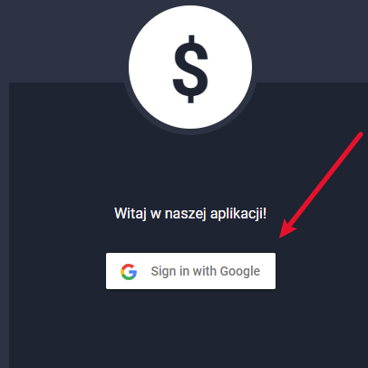

2. Select a currency

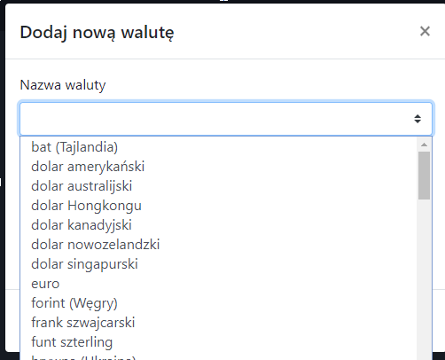

3. Control current exchange rate

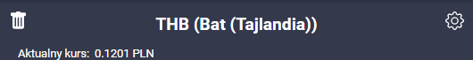

Select by days or date range

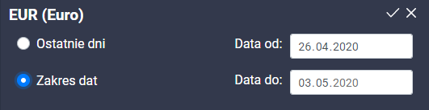

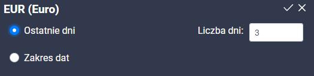

4. Control the currency over time

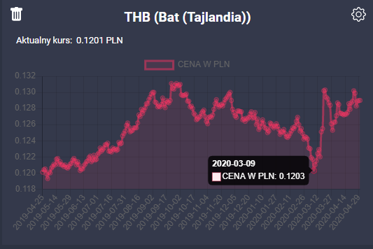

5. Dashboard with your currencies

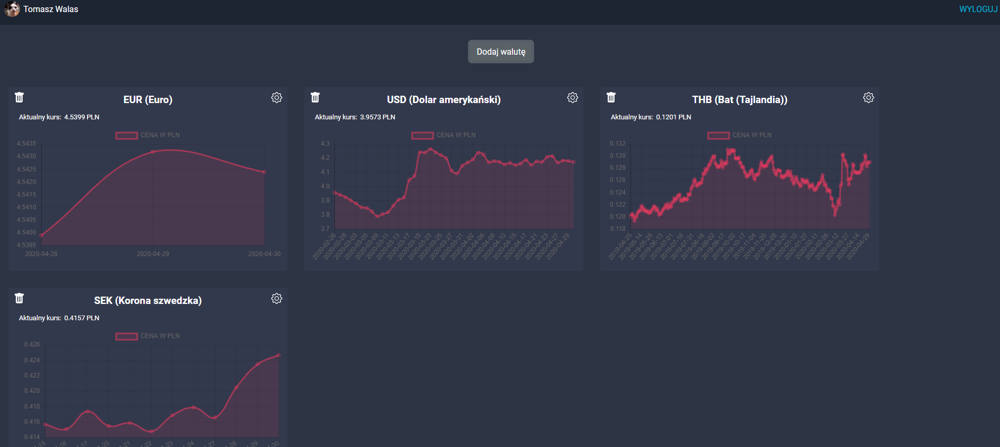

6. Manage your currencies

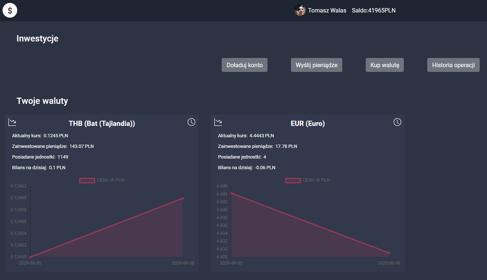

7. Add virtual money

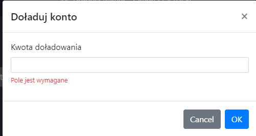

8. Send virtual money to your friend by email

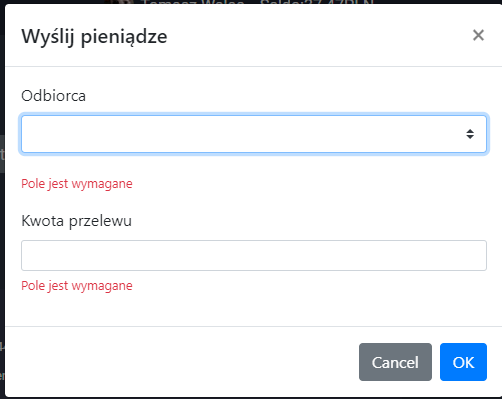

9. Buy currencies from your virtual pocket

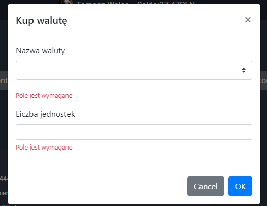

10. Operation history

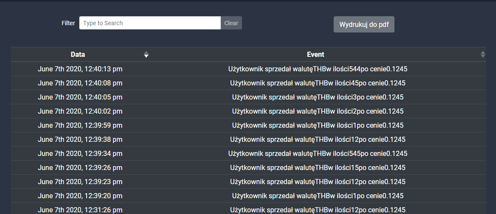

11. Sell your currencies

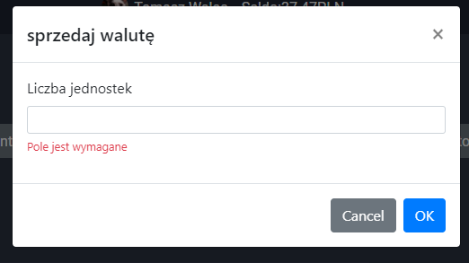

12. Widget presenting the selected currency

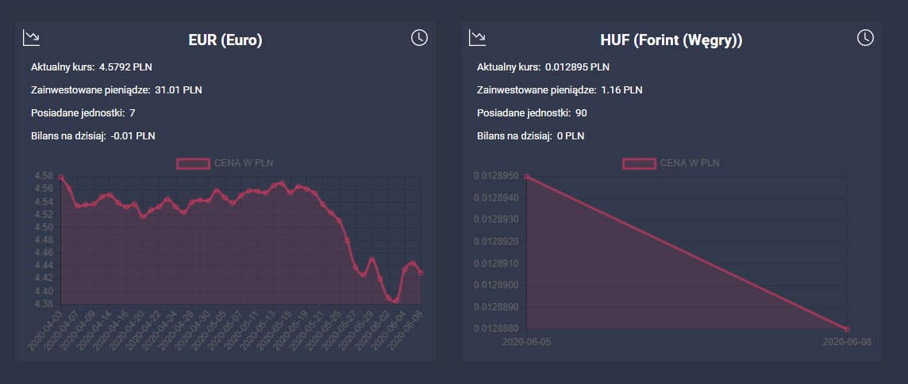

13. Generate PDF with summary of your accounts

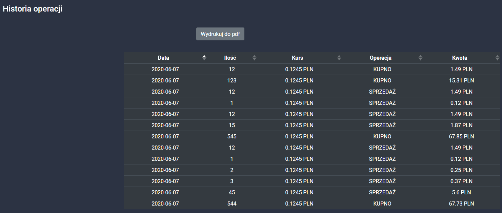

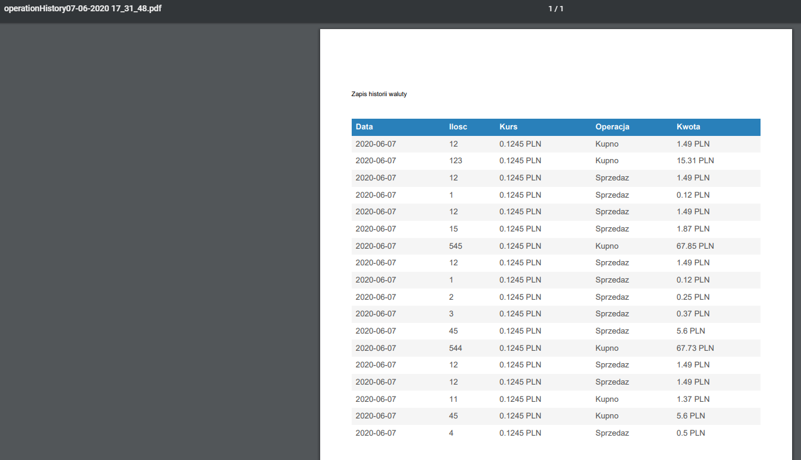

## Project setup

```
yarn install
```

### Compiles and hot-reloads for development

```
yarn serve
```

### Compiles and minifies for production

```
yarn build
```

### Lints and fixes files

```
yarn lint
```

### Customize configuration

See [Configuration Reference](https://cli.vuejs.org/config/).
